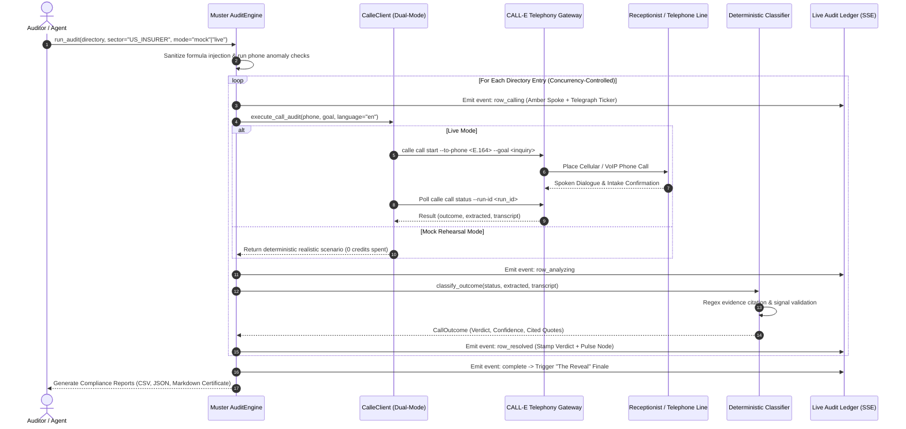

# 📡 MUSTER — Directory Ghost-Rate Auditor
> **An autonomous batch telephone verification engine and reusable Agent Skill that calls institutional directories to expose "ghost" listings, extract cited spoken evidence, and certify verifiable network adequacy.**

[](tests/)
[](pyproject.toml)
[](https://github.com/CALLE-AI/awesome-phone-call-agents)
[](muster/mcp_server.py)
[](muster/app/server.py)
[](LICENSE)

---

## 💡 The Problem: Institutional "Ghost Networks"

Public and commercial provider registries are fundamentally broken:
- **Commercial Health Insurers** advertise directories with thousands of in-network therapists, psychologists, and specialists. In reality, [US Senate Committee on Finance investigations (2023)](https://www.finance.senate.gov) revealed that **up to 70% of listed mental health providers are "ghosts"** — dead phone numbers, unallocated lines, providers who retired or withdrew from the network years ago, or clinics with permanently closed patient intake.
- **Government Healthcare Schemes** (e.g., PM-JAY Ayushman Bharat) maintain massive empanelled hospital registries. In practice, many facilities discontinue accepting scheme cards or de-empanel without municipal portal updates.
- **B2B & E-Commerce Marketplaces** display thousands of "verified" vendor profiles whose corporate registration or fulfillment lines are disconnected or hijacked by unrelated commercial businesses.

### The Human Consequence
When a vulnerable citizen, a grieving parent, or a patient in distress searches their insurer's portal, they face a frustrating barrier: **calling 10 to 15 numbers in a row only to find dead carrier intercepts, auto body repair shops, or receptionists who refuse their coverage.**

**Muster automates directory auditing offline.** Instead of forcing humans to discover ghosts during a crisis, Muster batch-calls every entry using **CALL-E**, asks **ONE benign qualifying question**, extracts structured operational signals, and returns each entry as **`PRESENT`**, **`GHOST`**, or **`UNREACHABLE`** — backed by verbatim spoken transcript evidence and confidence scores. It culminates in an executive **Ghost Rate** (e.g., *"7 of 12 audited = GHOST, 58.3%"*) and a real-world patient access metric (*"A patient must call ~2.4 listings to reach 1 real provider"*).

---

## 🔄 How Muster Works



---

## 🏛️ System Architecture

Muster is designed with a layered, framework-agnostic architecture where the core domain logic, safety guards, and classification heuristics are completely decoupled from the transport and presentation layers.

```
┌────────────────────────────────────────────────────────────────────────────────┐
│                           MUSTER SYSTEM ARCHITECTURE                           │
└────────────────────────────────────────────────────────────────────────────────┘

 ┌─────────────────────────┐   ┌──────────────────────────┐   ┌────────────────────────┐
 │   Reusable Agent Skill  │   │      FastMCP Server      │   │   Interactive Web UI   │
 │   skills/muster/        │   │   muster/mcp_server.py   │   │   muster/app/static/   │
 │   - SKILL.md            │   │   - audit_directory tool │   │   - Switchboard SVG    │
 │   - scripts/run_audit.py│   │   - stdio / agentic pipe │   │   - Tokens.css & Ledger│
 └───────────┬─────────────┘   └────────────┬─────────────┘   └───────────┬────────────┘
             │                              │                             │
             └──────────────────────┬───────┴─────────────────────────────┘
                                    │
                                    ▼
       ┌───────────────────────────────────────────────────────────┐
       │                Core Batch Engine (muster/)                │
       │  ┌─────────────────────────────────────────────────────┐  │
       │  │ AuditEngine (engine.py)                             │  │
       │  │ - Concurrency Semaphore (max 2-3 simultaneous calls)│  │
       │  │ - Async Event Queue (SSE event streaming)           │  │
       │  │ - Statistical Aggregator & Patient Access Ratio     │  │
       │  └──────────────────────────┬──────────────────────────┘  │
       │                             ▼                             │
       │  ┌─────────────────────────────────────────────────────┐  │
       │  │ Input Validation & Defensive Security (parser.py)   │  │
       │  │ - E.164 International Phone Normalizer              │  │
       │  │ - CSV Formula Injection Sanitizer (=, +, -, @)      │  │
       │  │ - Pre-Call Phone Sanity Check (Dummy / Dupes)       │  │
       │  └──────────────────────────┬──────────────────────────┘  │
       │                             ▼                             │
       │  ┌─────────────────────────────────────────────────────┐  │
       │  │ Evidence & Verdict Classifier (classifier.py)       │  │
       │  │ - Deterministic Schema Validation                   │  │
       │  │ - Regex Cited Quote Extraction                      │  │
       │  │ - Confidence Scoring (HIGH >= 0.90, MED, LOW)       │  │
       │  └──────────────────────────┬──────────────────────────┘  │
       └─────────────────────────────┼─────────────────────────────┘
                                     │
                                     ▼
       ┌───────────────────────────────────────────────────────────┐
       │            Telephony Abstraction Layer                    │
       │  ┌─────────────────────────────────────────────────────┐  │
       │  │ MockCalleClient (calle_client.py)                   │  │
       │  │ - 100% Offline, Deterministic Rehearsals (0 credits)│  │
       │  │ - Zero-Live-Call Guarantee in Test Suite            │  │
       │  └─────────────────────────────────────────────────────┘  │
       │  ┌─────────────────────────────────────────────────────┐  │
       │  │ CalleClient (calle_client.py)                       │  │
       │  │ - CLI Subprocess: calle call start -> call status   │  │
       │  │ - Resilient Fallback: FAILED / ByCallee -> UNREACH  │  │
       │  │ - Credit Guard Confirmation Protection              │  │
       │  └──────────────────────────┬──────────────────────────┘  │
       └─────────────────────────────┼─────────────────────────────┘
                                     │
                                     ▼
                        ┌─────────────────────────┐
                        │   CALL-E Cloud Gateway  │
                        │   airudder MCP Broker   │
                        │   Carrier Network Calls │
                        └─────────────────────────┘
```

---

## 🎯 Sector Archetypes

Muster supports two battle-tested sector archetypes with dedicated qualification inquiries and schema extractions:

| Dimension | `US_INSURER` (Hero Demo) | `MARKETPLACE_SELLER` |
| :--- | :--- | :--- |
| **Domain** | US Commercial & Medicare Advantage In-Network Rolls | Verified E-Commerce & Retail Marketplace Directories |
| **Target Entities** | Primary Care, Therapists, Clinics, Specialists | Online Merchants, Physical Retail Stores, Vendors |
| **Regulatory Anchor** | CMS Network Adequacy Rules & No Surprises Act | Consumer Protection & Anti-Fraud Merchant Registries |
| **Default Inquiry** | *"Hello, I am calling to verify directory network status. Are you currently in-network and accepting new patients?"* | *"Hello, calling for merchant directory verification. Are you currently operational and fulfilling orders for your store?"* |
| **Extraction Schema** | `reached_human`: bool<br>`in_network`: bool<br>`accepting_new_patients`: bool<br>`stated_reason`: string | `reachable`: bool<br>`operational`: bool<br>`sells_claimed_product`: bool<br>`stated_reason`: string |
| **Ghost Triggers** | Left network, self-pay only, closed intake, wrong number, disconnected | Business dissolved, out of business, does not stock goods, wrong number |

---

## ⚖️ Classification & Decision Matrix

Every audited listing resolves into one of four definitive statuses with cryptographic-level traceability:

| Verdict | Criteria & Signals | Confidence | Spoken Evidence Example | Action Required |
| :--- | :--- | :---: | :--- | :--- |
| **`PRESENT`** | Human reached; affirmatively confirms in-network status / active operations; accepting new patients / fulfilling orders. | **`HIGH`**<br>(0.90–0.98) | *"Yes, our clinic is currently in-network and accepting new patients for both telehealth and in-person visits."* | Keep in directory; mark certified active. |
| **`GHOST`** | Disconnected carrier line; wrong number / auto shop; provider explicitly withdrew from scheme; business permanently shut. | **`HIGH`**<br>(0.92–0.98) | *"We left that insurance network over six months ago. The online directory is completely outdated."* | **Immediate de-listing**; strike through in directory roll. |
| **`UNREACHABLE`** | Call timed out after 45s; line busy; subscriber declined (ByCallee); automated IVR voicemail loop without human respondent. | **`HIGH` / `MED`**<br>(0.75–0.95) | *"Call rang for 45 seconds with zero answer."* / *"Carrier delivery error: line unreachable."* | Route to secondary re-dial retry queue. |
| **`UNCERTAIN`** | Inconclusive dialogue turn; ambiguous answer; line dropped mid-conversation before affirmation or denial. | **`LOW`**<br>(0.50) | *"Call disconnected prematurely before receptionist completed verification."* | Flag for manual human operator review. |

---

## 🖥️ Live Audit Ledger (Visual Showcase)

The frontend is built according to the **v2 Design Lock** ([`handoff/DESIGN.md`](file:///c:/Users/user/Desktop/Call%20E/handoff/DESIGN.md)) using committed tokens in [`tokens.css`](file:///c:/Users/user/Desktop/Call%20E/muster/app/static/css/tokens.css):
- **Archival Ground & Editorial Serif**: Background in cool archival bone (`#F3F4F2`), paper cards (`#FCFCFB`), and display typography in **Newsreader** serif with **Public Sans** body and **JetBrains Mono** data streams. Zero Inter or Plus Jakarta Sans.
- **Dark Switchboard Network Centerpiece**: Right hero panel with radial gradient dark backdrop (`#171a21`), operator hub, radial spoke lines, radiating amber pulse waves on dial, and status-colored node caps.
- **Interactive Node Tooltips**: Hovering over any switchboard node displays an instant HUD card with the provider name, contact number, geographic specialty, and real-time status badge.
- **Bidirectional Ledger Linking**: Clicking a node scrolls and highlights the matching ledger row; clicking a ledger row pulses the switchboard node.
- **Telegraph Transcripts & Ink Stamps**: Rows resolve in sync with live call progression via typewriter text tickers (`calling… ▸ dialing +1555…`), popping in flat matte ink-stamps tilted at `-3deg` (`.st-present`, `.st-ghost`, `.st-unreach`).
- **"The Reveal" Finale**: When the batch completes, confirmed ghost nodes crack, disconnect, and drop down (`translateY(45px)`, opacity 0.15), leaving the true surviving network standing. In the ledger, defunct listings are struck through and desaturated.
- **Derived Patient Access Metric**: Calculates the exact formula:
  $$\text{Access Ratio } (N) = \frac{1}{1 - \text{Ghost Rate}}$$
  And tags the directory with an institutional adequacy tier:
  - **`0% – 10%`**: `PRIME`
  - **`11% – 25%`**: `COMPROMISED`
  - **`26% – 50%`**: `HIGH-RISK`
  - **`> 50%`**: `DEFECTIVE` (e.g. *"A patient must call ~2.4 listings to reach 1 real provider · DEFECTIVE"*)

---

## 🔒 Defensive Security & Fraud Signals (Milestone 5)

Muster includes enterprise-grade safety guardrails to protect auditor machines and telephony budgets:

1. **CSV Formula Injection Sanitizer (`muster/parser.py`, `muster/report.py`)**:
   - Neutralizes formula injection vectors (DDE attacks) where malicious directories embed `=cmd|' /C calc'!A0`, `+`, `-`, or `@` in entity names.
   - Prepends a single quote (`'`) to neutralize Excel/Google Sheets execution on both file import and report export.
2. **Pre-Call Phone Sanity & Anomaly Engine (`pre_call_phone_sanity_check`)**:
   - **Invalid Length Detection**: Rejects numbers with `< 10` or `> 15` digits before dialing.
   - **Dummy Pattern Detection**: Identifies repeated dummy sequences (e.g. `5555555555`, `0000000000`).
   - **Cross-Entity Line Duplication**: Flags when multiple distinct commercial entities share the exact same phone line (a key indicator of aggregator fraud or phantom clinics).
3. **Credit-Guard Safety Architecture**:
   - Web UI features a modal confirmation barrier before launching any `live` audit, displaying active session tokens and metered usage warnings (~34 credits/minute).
   - CLI enforces `--confirm-live` or presents an interactive terminal prompt before placing real telephony calls.
4. **Zero-Live-Call Guarantee in Test Suite**:
   - Unit test suite is guaranteed 100% offline. Verified by `test_zero_live_calls_guarantee`, ensuring no test ever invokes subprocesses or burns live credits.

---

## 🤖 Developer & Agent Integration

### 1. FastMCP Tool (`muster/mcp_server.py`)
Any LLM or agent runtime supporting the Model Context Protocol (MCP) can invoke Muster as a native tool:

```python
import asyncio
from muster.mcp_server import audit_directory

async def main():
    report_markdown = await audit_directory(
        file_path="sample_data/us_insurer_network.json",
        sector="US_INSURER",
        mode="mock" # or "live"
    )
    print(report_markdown)

asyncio.run(main())
```

### 2. Standalone Agent Skill Runner (`skills/muster/scripts/run_audit.py`)
Portable CLI script ready for the `awesome-phone-call-agents` ecosystem:
```bash
python skills/muster/scripts/run_audit.py sample_data/us_insurer_network.json --mode mock
```

### 3. Server-Sent Events (SSE) Web API
FastAPI exposes real-time streaming endpoints:
- `POST /api/audit/start`: Initiates a batch audit job and returns `job_id`.
- `GET /api/audit/events/{job_id}`: Connects to live SSE stream emitting row progress events.
- `GET /api/audit/report/{job_id}/{fmt}`: Downloads compliance reports (`csv`, `json`, `md`).

---

## 📁 Repository Structure

```text
Call E/
├── muster/                          # Core Python Package (Framework-Agnostic)
│   ├── __init__.py                  # Package metadata
│   ├── models.py                    # Pydantic schemas (DirectoryEntry, CallOutcome, Verdict)
│   ├── parser.py                    # CSV/JSON parser, formula sanitizer & phone sanity check
│   ├── classifier.py                # Deterministic verdict classifier & quote extractor
│   ├── calle_client.py              # Subprocess CALL-E caller & MockCalleClient harness
│   ├── engine.py                    # Async batch runner, concurrency control, SSE streams
│   ├── report.py                    # CSV, JSON, and Markdown Audit Certificate generators
│   ├── cli.py                       # Rich terminal CLI with credit-guard prompt
│   ├── mcp_server.py                # FastMCP server exposing audit_directory tool
│   └── app/                         # FastAPI Web Audit Ledger
│       ├── server.py                # FastAPI REST and SSE endpoints
│       └── static/                  # Responsive Vanilla CSS/JS SPA (Design Lock v2)
│           ├── index.html           # Full-bleed layout, SVG switchboard, dial, modals
│           ├── css/
│           │   ├── tokens.css       # Committed design tokens (Newsreader, palette)
│           │   └── style.css        # Responsive layout, animations, stamps, tooltips
│           └── js/
│               └── app.js           # Live SSE consumer, switchboard engine, "The Reveal"
├── skills/
│   └── muster/                      # Reusable Agent Skill (PR to awesome-phone-call-agents)
│       ├── SKILL.md                 # Agent skill definition & documentation
│       └── scripts/
│           └── run_audit.py         # Portable standalone runner script
├── sample_data/                     # Pre-baked directories for audits & demos
│   ├── us_insurer_network.json      # Hero directory: 12 US in-network providers (English)
│   ├── marketplace_sellers.json     # 6 verified marketplace vendors
│   ├── hospitals_pmjay.json         # 12 Indian PM-JAY hospitals
│   ├── therapists_network.json      # 8 mental health providers
│   └── hospitals_pmjay.csv          # CSV format sample
├── tests/                           # Comprehensive automated test suite (Zero live calls)
│   ├── conftest.py                  # Pytest fixtures and environment configuration
│   ├── test_milestones.py           # Milestones 1-5 tests (US Insurer, Seller, Sanitizer, Pre-call)
│   ├── test_calle_client.py         # CALL-E attribution & mock scenario validation
│   ├── test_classifier.py           # Verdict classification & evidence quote regex matching
│   ├── test_engine.py               # Batch engine streaming order & report generation
│   ├── test_ghost_rate.py           # Ghost rate math precision & edge cases (0%, 100%, empty)
│   └── test_parser.py               # E.164 phone normalization & CSV/JSON parsing
├── pyproject.toml                   # Poetry/pip build configuration & dependencies
├── README.md                        # Master repository documentation
└── .gitignore                       # Protects handoff/, reports/, and secrets
```

---

## 🚀 Getting Started

### 1. Prerequisites
- **Python 3.10+**
- **CALL-E CLI** (v0.5.1+) installed and authenticated (for live calls only):
  ```bash
  calle auth status
  ```

### 2. Installation
```bash
git clone https://github.com/omshukla24/Muster.git
cd Muster
pip install -e .
```

### 3. Launch the Web Audit Ledger
```bash
python -m muster.cli ui --port 8000
```
Open **`http://127.0.0.1:8000`** in your browser.
1. Inspect the switchboard and ghost-rate dial.
2. Select your desired rehearsal speed (`1x`, `2x`, or `Instant`).
3. Click **"▶ Run audit"** to watch the real-time telegraph tickers and "The Reveal" finale.

### 4. Run via Terminal CLI
```bash
# Offline Mock Rehearsal (Zero cost, 0 credits)
python -m muster.cli audit sample_data/us_insurer_network.json --mode mock --out reports/

# Live CALL-E Telephony Verification (Credit guarded)
python -m muster.cli audit sample_data/us_insurer_network.json --mode live --concurrency 2
```

### 5. Run Automated Tests
```bash
pytest tests/ -v
```
All **30 tests pass in < 0.20s** completely offline.

---

## ⚖️ License
MIT © 2026 Om Shukla & Muster Contributors. Open source for community reuse.
