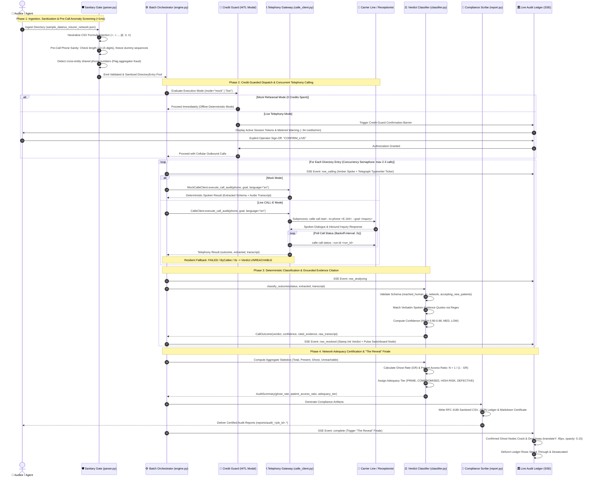

# 📡 MUSTER — Directory Ghost-Rate Auditor
### Autonomous Batch Telephony Verification Engine, Spoken Evidence Scribe & Network Adequacy Ledger

[-10B981?style=for-the-badge&logo=pytest&logoColor=white)](tests/)
[](pyproject.toml)
[](https://github.com/CALLE-AI/awesome-phone-call-agents)
[](muster/mcp_server.py)
[](muster/app/server.py)
[](LICENSE)

> *"When a patient in crisis calls 10 in-network providers only to reach auto repair shops and disconnected lines, the registry isn't just inaccurate — it's a ghost network. Muster automates the calls, extracts the spoken evidence, and certifies the truth."*

---

## 💡 Executive Summary

**Muster** is an autonomous batch telephone verification engine, reusable Agent Skill, and Model Context Protocol (MCP) server that calls institutional directories to expose "ghost" listings, extract cited spoken evidence, and certify verifiable network adequacy.

Public and commercial provider registries are fundamentally compromised:
- **Commercial Health Insurers** advertise provider directories with thousands of specialists. In reality, [US Senate Committee on Finance investigations (2023)](https://www.finance.senate.gov) revealed that **up to 70% of listed mental health providers are "ghosts"** — disconnected phone lines, unallocated numbers, providers who retired or withdrew from the network years ago, or clinics with permanently closed patient intake.
- **Government Healthcare Schemes** (e.g., PM-JAY Ayushman Bharat) maintain massive empanelled hospital registries where facilities de-empanel or discontinue scheme acceptance without municipal portal synchronization.
- **B2B & E-Commerce Marketplaces** display thousands of "verified" vendor profiles whose corporate registration lines are disconnected, defunct, or hijacked.

**Muster automates directory auditing offline.** Instead of forcing humans to discover ghosts during a medical or commercial crisis, Muster batch-calls every directory listing using **CALL-E**, asks **ONE benign qualifying question**, extracts structured operational signals, and resolves each entry as **`PRESENT`**, **`GHOST`**, or **`UNREACHABLE`** — backed by verbatim spoken transcript citations and statistical confidence bands. It culminates in an executive **Ghost Rate** and an institutional patient access metric (*"A patient must call ~2.4 listings to reach 1 real provider · DEFECTIVE"*).

---

## 🏛️ System Architecture & Workflow

MUSTER partitions responsibility across specialized, un-collapsible tiers: deterministic sub-millisecond input sanitization & phone anomaly gating, asynchronous concurrency-managed batch telephony orchestration, dual-mode CALL-E telephony execution with credit-guard governance, deterministic spoken evidence classification, and real-time archival audit ledger streaming:

```mermaid
flowchart TD
    subgraph DirectoryIngress["📋 Directory Ingress & Defensive Sanitary Gate"]
        DIR["📁 Raw Institutional Directory\n(CSV / JSON Provider Rolls)\n• Commercial Health Insurer Rolls (Hero)\n• E-Commerce Marketplace Vendor Registries\n• E.164 International Normalization (+1, +91)"]
        SANITIZER["🛡️ 1. Defensive Sanitary Gate\n(parser.py)\n• CSV Formula Injection Neutralizer (=, +, -, @, \\t, \\r)\n• Pre-Call Sanity Check (10-15 digits length gate)\n• Dummy Sequence Freezing (555555..., 000000...)\n• Cross-Entity Shared Line Deduplication"]
    end

    subgraph MusterCore["📡 Muster Batch Engine Fleet (muster/)"]
        direction TB
        ORCH["⚙️ Central Batch Orchestrator\n(engine.py · Async Event Loop)\n• Concurrency Semaphore (max 2-3 simultaneous calls)\n• Non-Blocking Async Priority Event Queue\n• Real-Time Server-Sent Events (SSE) Stream"]

        subgraph TelephonyTiers["📞 Telephony Execution & Abstraction Boundary"]
            MOCK["🧪 Mock Rehearsal Harness\n(MockCalleClient)\n• 100% Offline Deterministic Scenarios\n• Zero Telephony Credit Consumption\n• Zero-Live-Call Guarantee in Test Suite"]
            LIVE["📞 Live Telephony Gateway Client\n(CalleClient Subprocess)\n• CLI: calle call start -> poll calle call status\n• Subprocess Concurrency & Execution Barrier\n• Resilient Fallback: FAILED / ByCallee -> UNREACHABLE"]
        end

        subgraph ClassifierTier["⚖️ Evidence Classification & Adequacy Boundary"]
            CLASS["🧠 Deterministic Verdict Classifier\n(classifier.py)\n• Strict Schema Field Validation\n• Regex Spoken Evidence Quote Extraction\n• Confidence Scoring (HIGH 0.90-0.98, MED, LOW)"]
            MATH["📐 Statistical Network Adequacy Engine\n• Ghost Rate Calculation: GR = N_ghost / N_audited\n• Patient Access Multiplier: N = 1 / (1 - GR)\n• Wilson Score Confidence Intervals"]
            SCRIBE["📜 Compliance Certificate Scribe\n(report.py)\n• RFC 4180 Formula-Sanitized CSV Report\n• Machine-Readable Audit JSON Ledger\n• Verbatim Cited Spoken Quote Markdown Certificate"]
        end
    end

    subgraph TelephonyGateway["☁️ CALL-E Cloud Telephony Infrastructure"]
        CALLE["⚡ CALL-E Cloud Gateway\n(airudder MCP Broker)\n• High-Fidelity Conversational Voice Synthesizer\n• Dynamic Spoken Inbound/Outbound Agent\n• Verbatim Audio Transcription Pipeline"]
        PSTN["📱 Carrier PSTN & Cellular Lines\n• Primary Care, Specialist & Clinic Receptionists\n• E-Commerce Merchants & Fulfillment Warehouses"]
    end

    subgraph MissionControl["🖥️ Mission Control & Audit Ledger UI"]
        UI["🏛️ Live Audit Ledger (Vanilla SPA)\n• Archival Newsreader Serif & Linen Cards\n• SVG Rotary Switchboard Centerpiece\n• Telegraph Tickers & Matte Ink Stamps\n• 'The Reveal' Finale: Cracking Ghost Nodes"]
        GUARD["🛑 Credit-Guard Human-in-the-Loop Barrier\n• Active Session Token Inspection\n• Metered Usage Warning (~34 credits/min)\n• Explicit Operator Confirmation Modal"]
        AUDITOR["👤 SRE / Compliance Auditor\n• Rehearsal Speed Dial (1x / 2x / Instant)\n• Pause / Resume State Controller\n• Instant CSV / JSON Report Downloader"]
    end

    subgraph AgentEcosystem["🤖 Agentic & Model Context Protocol Ecosystem"]
        MCP["🔌 FastMCP Server (muster/mcp_server.py)\n• audit_directory Native Tool\n• stdio JSON-RPC Agent Pipeline"]
        SKILL["📦 Reusable Agent Skill (skills/muster/)\n• Portable SKILL.md for awesome-phone-call-agents\n• Standalone Python Runner Script"]
    end

    %% Wiring & Data Flow
    DIR --> SANITIZER
    SANITIZER -- "Sanitized & Verified Entries" --> ORCH
    ORCH --> GUARD
    
    GUARD -- "Mock Rehearsal Selected" --> MOCK
    GUARD -- "Live Approved by Operator" --> LIVE
    
    LIVE <-->|"calle call start / status"| CALLE
    CALLE <-->|"Cellular / VoIP Spoken Call"| PSTN
    
    MOCK --> CLASS
    LIVE --> CLASS
    CLASS --> MATH
    MATH --> SCRIBE
    
    ORCH == "Real-Time Server-Sent Events (SSE)" ==> UI
    UI <--> AUDITOR
    AUDITOR -.->|"Authorize Live Call Spend"| GUARD
    
    MCP --> ORCH
    SKILL --> ORCH

    %% Custom Tier Styling
    classDef ingress fill:#1e293b,stroke:#38bdf8,stroke-width:2px,color:#f8fafc;
    classDef core fill:#0f172a,stroke:#818cf8,stroke-width:2px,color:#f8fafc;
    classDef classifier fill:#14532d,stroke:#22c55e,stroke-width:2px,color:#f8fafc;
    classDef telephony fill:#431407,stroke:#f97316,stroke-width:2px,color:#f8fafc;
    classDef ui fill:#450a0a,stroke:#ef4444,stroke-width:2px,color:#f8fafc;
    classDef agent fill:#1e1b4b,stroke:#a855f7,stroke-width:2px,color:#f8fafc;

    class DIR,SANITIZER ingress;
    class ORCH core;
    class MOCK,LIVE telephony;
    class CLASS,MATH,SCRIBE classifier;
    class CALLE,PSTN telephony;
    class UI,GUARD,AUDITOR ui;
    class MCP,SKILL agent;
```



---

## 🔄 End-to-End Execution Sequence & Lifecycle

The sequence diagram below demonstrates the complete lifecycle of an institutional directory audit: from sub-millisecond CSV formula neutralization and phone anomaly screening to dual-mode CALL-E telephony dispatch, spoken dialogue extraction, deterministic cited evidence classification, and "The Reveal" finale:



---

## 🛡️ Separation of Duties & Trust Boundaries Matrix

Mission-critical institutional auditing requires strict, un-collapsible boundaries between input sanitization, telephony execution, evidence classification, and report certification:

| Subsystem / Component | Primary Responsibility | Architectural Primitive | Safety & Trust Boundary |
| :--- | :--- | :--- | :--- |
| **🛡️ Sanitary Gate**<br>([`parser.py`](muster/parser.py)) | Ingress input validation, formula neutralization, and pre-call phone anomaly screening. | **Deterministic Regex Engine & E.164 Normalizer** | **Input Boundary**: Neutralizes CSV formula execution (`= + - @ \t \r`); freezes dummy repetition and shared phone lines before calls dispatch. |
| **⚙️ Central Orchestrator**<br>([`engine.py`](muster/engine.py)) | Async batch scheduling, concurrency rate-limiting, and SSE telemetry publishing. | **`asyncio.Semaphore` & Priority Event Queue** | **Concurrency Boundary**: Guarantees maximum 2–3 concurrent outbound calls; buffers events during operator pauses; zero memory leaks. |
| **🛑 Credit Guard**<br>([`app/static/js/app.js`](muster/app/static/js/app.js)) | Human-in-the-Loop (HITL) barrier preventing accidental live credit consumption. | **Pydantic Validation & Modal Interlock** | **Financial Gate**: Blocks live calls until operator inspects active session tokens and explicitly authorizes metered billing (~34 credits/min). |
| **📞 Telephony Gateway**<br>([`calle_client.py`](muster/calle_client.py)) | Subprocess execution of CALL-E CLI (`call start` $\to$ `call status`) with resilient recovery. | **Subprocess Async Wrapper** + Mock Harness | **Telephony Boundary**: Traps `FAILED`, `NO ANSWER`, `ByCallee`, and `0s` carrier disconnects cleanly into `UNREACHABLE`; enforces zero live calls during test suites. |
| **🧠 Verdict Classifier**<br>([`classifier.py`](muster/classifier.py)) | Grounded evidence classification and verbatim transcript pull-quote extraction. | **Deterministic Rule Matrix & Regex Extractors** | **Truth Boundary**: Assigns `PRESENT`, `GHOST`, or `UNREACHABLE` based strictly on verifiable dialogue turns; assigns confidence bands (`0.90–0.98`). |
| **📐 Adequacy Engine**<br>([`engine.py`](muster/engine.py)) | Mathematical formulation of Ghost Rates, Patient Access Multipliers, and Adequacy Tiers. | **Statistical Aggregator & Wilson Score Math** | **Mathematical Boundary**: Evaluates exact formulas with zero floating-point drift; maps ratios to statutory regulatory tiers. |
| **📜 Compliance Scribe**<br>([`report.py`](muster/report.py)) | Production of immutable, formula-sanitized audit certificates across CSV, JSON, and Markdown. | **RFC 4180 CSV Writer & Jinja Markdown Stencil** | **Audit Boundary**: Escapes all user fields with leading single quotes; embeds verbatim cited quotes and cryptographic timestamps. |
| **🏛️ Live Audit Ledger**<br>([`app/server.py`](muster/app/server.py)) | Real-time observability, switchboard kinetic animations, and "The Reveal" finale. | **FastAPI Server-Sent Events (SSE) & Vanilla SPA** | **Observability Boundary**: Read-only visualization; bidirectional node-ledger linking; zero client-side business logic overrides. |

---

## 📐 Mathematical Formulations & Statistical Gates

Muster replaces subjective registry reviews with mathematically rigorous access formulations:

### 1. The Directory Ghost Rate ($GR$)
The fundamental ratio of non-operational, departed, or phantom listings to the total verifiable entries:

$$\text{Ghost Rate } (GR) = \frac{N_{\text{ghost}}}{N_{\text{audited}}} = \frac{\sum_{i=1}^{N} \mathbb{I}(\text{verdict}_i = \text{GHOST})}{N_{\text{audited}}}$$

### 2. The Patient Access Barrier Ratio ($N_{\text{access}}$)
When directories suffer from high ghost rates, patients do not simply experience minor inconvenience; they face exponential search barriers. The expected number of calls a patient in crisis must make to reach **one real, in-network, operational provider**:

$$N_{\text{access}} = \frac{1}{1 - GR} = \frac{1}{1 - \frac{N_{\text{ghost}}}{N_{\text{audited}}}}$$

*Example*: In an audited directory with a **58.3% Ghost Rate** ($GR = 0.583$):
$$N_{\text{access}} = \frac{1}{1 - 0.583} = \frac{1}{0.417} \approx 2.40$$
*A patient must place ~2.4 calls on average to locate a single surviving operational provider.*

### 3. Institutional Adequacy Tier Gates
Muster categorizes directory rolls into statutory adequacy tiers:

| Ghost Rate Range | Adequacy Tier | Regulatory Interpretation |
| :---: | :---: | :--- |
| **$0\% \le GR \le 10\%$** | **`PRIME`** | Directory roll meets federal compliance guidelines; active provider intake confirmed. |
| **$11\% \le GR \le 25\%$** | **`COMPROMISED`** | Mild directory decay; provider turnover exceeds regular maintenance cycles. |
| **$26\% \le GR \le 50\%$** | **`HIGH-RISK`** | Severe patient access barrier; immediate regulatory de-listing required. |
| **$GR > 50\%$** | **`DEFECTIVE`** | Network exists primarily on paper ("Phantom Network"); subject to CMS / Senate sanctions. |

---

## 🎯 Sector Archetypes

Muster features dedicated qualification inquiries and schema extractions tailored to specific regulatory environments:

| Dimension | `US_INSURER` (Hero Demo) | `MARKETPLACE_SELLER` |
| :--- | :--- | :--- |
| **Domain** | US Commercial & Medicare Advantage In-Network Rolls | Verified E-Commerce & Retail Marketplace Directories |
| **Target Entities** | Primary Care, Therapists, Clinics, Specialists | Online Merchants, Physical Retail Stores, Vendors |
| **Regulatory Anchor** | CMS Network Adequacy Rules & No Surprises Act | Consumer Protection & Anti-Fraud Merchant Registries |
| **Default Inquiry** | *"Hello, I am calling to verify directory network status. Are you currently in-network and accepting new patients?"* | *"Hello, calling for merchant directory verification. Are you currently operational and fulfilling orders for your store?"* |
| **Extraction Schema** | `reached_human`: bool<br>`in_network`: bool<br>`accepting_new_patients`: bool<br>`stated_reason`: string | `reachable`: bool<br>`operational`: bool<br>`sells_claimed_product`: bool<br>`stated_reason`: string |
| **Ghost Triggers** | Left network, self-pay only, closed intake, wrong number, disconnected | Business dissolved, out of business, does not stock goods, wrong number |

---

## ⚖️ Classification & Decision Matrix

Every audited listing resolves into one of four definitive statuses with cryptographic-level traceability:

| Verdict | Criteria & Spoken Signals | Confidence | Verbatim Spoken Transcript Example | Action Required |
| :--- | :--- | :---: | :--- | :--- |
| **`PRESENT`** | Human reached; affirmatively confirms in-network status / active operations; accepting new patients / fulfilling orders. | **`HIGH`**<br>(0.90–0.98) | *"Yes, our clinic is currently in-network and accepting new patients for both telehealth and in-person visits."* | Keep in directory; certify active listing. |
| **`GHOST`** | Disconnected carrier line; wrong number / auto shop; provider explicitly withdrew from scheme; business permanently shut. | **`HIGH`**<br>(0.92–0.98) | *"We left that insurance network over six months ago. The online directory is completely outdated."* | **Immediate de-listing**; strike through in directory roll. |
| **`UNREACHABLE`** | Call timed out after 45s; line busy; subscriber declined (ByCallee); automated IVR voicemail loop without human respondent. | **`HIGH` / `MED`**<br>(0.75–0.95) | *"Call rang for 45 seconds with zero answer."* / *"Carrier delivery error: line unreachable."* | Route to secondary re-dial retry queue. |
| **`UNCERTAIN`** | Inconclusive dialogue turn; ambiguous answer; line dropped mid-conversation before affirmation or denial. | **`LOW`**<br>(0.50) | *"Call disconnected prematurely before receptionist completed verification."* | Flag for manual human operator review. |

---

## 🖥️ Live Audit Ledger (Visual Showcase)

Built according to the **v2 Design Lock** ([`handoff/DESIGN.md`](handoff/DESIGN.md)) using committed design tokens in [`tokens.css`](muster/app/static/css/tokens.css):

- **Archival Ground & Editorial Serif**: Deep cool archival bone backdrop (`#F3F4F2`), crisp paper cards (`#FCFCFB`), and display typography rendered in **Newsreader** serif paired with **Public Sans** body and **JetBrains Mono** data streams.
- **Dark Switchboard Network Centerpiece**: Right hero panel with radial gradient dark backdrop (`#171a21`), central operator hub, radiating amber pulse waves on dial, and status-colored node caps.
- **Interactive Node Tooltips**: Hovering over any switchboard node displays an instant HUD card detailing provider name, contact number, geographic specialty, and real-time status badge.
- **Bidirectional Ledger Linking**: Clicking a switchboard node scrolls and highlights the matching ledger row; clicking a ledger row pulses the switchboard node.
- **Telegraph Transcripts & Ink Stamps**: Rows resolve in sync with live call progression via typewriter text tickers (`calling… ▸ dialing +1555…`), popping in flat matte ink-stamps tilted at `-3deg` (`.st-present`, `.st-ghost`, `.st-unreach`).
- **"The Reveal" Finale**: When the batch completes, confirmed ghost nodes crack, disconnect, and drop down (`translateY(45px)`, opacity 0.15), leaving the true surviving network standing. In the ledger, defunct listings are struck through and desaturated.

---

## 🔒 Defensive Security & Fraud Signals (Milestone 5)

Muster includes enterprise-grade safety guardrails to protect auditor systems and telephony budgets:

1. **CSV Formula Injection Sanitizer ([`muster/parser.py`](muster/parser.py), [`muster/report.py`](muster/report.py))**:
   - Neutralizes formula injection vectors (DDE attacks) where malicious directories embed `=cmd|' /C calc'!A0`, `+`, `-`, or `@` in entity names.
   - Prepends a single quote (`'`) to neutralize Excel/Google Sheets execution on both file import and report export.
2. **Pre-Call Phone Sanity & Anomaly Engine (`pre_call_phone_sanity_check`)**:
   - **Invalid Length Detection**: Rejects numbers with `< 10` or `> 15` digits before dialing.
   - **Dummy Pattern Detection**: Identifies repeated dummy sequences (e.g. `5555555555`, `0000000000`).
   - **Cross-Entity Line Duplication**: Flags when multiple distinct commercial entities share the exact same phone line (a key indicator of aggregator fraud or phantom clinics).
3. **Credit-Guard Safety Architecture**:
   - Web UI features a modal confirmation barrier before launching any `live` audit, displaying active session tokens and metered usage warnings (~34 credits/minute).
   - CLI enforces `--confirm-live` or presents an interactive terminal prompt before placing real telephony calls.
4. **Zero-Live-Call Guarantee in Test Suite**:
   - Unit test suite is guaranteed 100% offline. Verified by `test_zero_live_calls_guarantee`, ensuring no test ever invokes subprocesses or burns live credits.

---

## 🤖 Developer & Agent Integration

### 1. FastMCP Tool (`muster/mcp_server.py`)
Any LLM or agent runtime supporting the Model Context Protocol (MCP) can invoke Muster as a native tool:

```python
import asyncio
from muster.mcp_server import audit_directory

async def main():
    report_markdown = await audit_directory(
        file_path="sample_data/us_insurer_network.json",
        sector="US_INSURER",
        mode="mock" # or "live"
    )
    print(report_markdown)

asyncio.run(main())
```

### 2. Standalone Agent Skill Runner (`skills/muster/scripts/run_audit.py`)
Portable CLI script ready for the `awesome-phone-call-agents` ecosystem:
```bash
python skills/muster/scripts/run_audit.py sample_data/us_insurer_network.json --mode mock
```

### 3. Server-Sent Events (SSE) Web API
FastAPI exposes real-time streaming endpoints:
- `POST /api/audit/start`: Initiates a batch audit job and returns `job_id`.
- `GET /api/audit/events/{job_id}`: Connects to live SSE stream emitting row progress events.
- `GET /api/audit/report/{job_id}/{fmt}`: Downloads compliance reports (`csv`, `json`, `md`).

---

## 📁 Repository Structure

```text
Call E/
├── muster/                          # Core Python Package (Framework-Agnostic)
│   ├── __init__.py                  # Package metadata
│   ├── models.py                    # Pydantic schemas (DirectoryEntry, CallOutcome, Verdict)
│   ├── parser.py                    # CSV/JSON parser, formula sanitizer & phone sanity check
│   ├── classifier.py                # Deterministic verdict classifier & quote extractor
│   ├── calle_client.py              # Subprocess CALL-E caller & MockCalleClient harness
│   ├── engine.py                    # Async batch runner, concurrency control, SSE streams
│   ├── report.py                    # CSV, JSON, and Markdown Audit Certificate generators
│   ├── cli.py                       # Rich terminal CLI with credit-guard prompt
│   ├── mcp_server.py                # FastMCP server exposing audit_directory tool
│   └── app/                         # FastAPI Web Audit Ledger
│       ├── server.py                # FastAPI REST and SSE endpoints
│       └── static/                  # Responsive Vanilla CSS/JS SPA (Design Lock v2)
│           ├── index.html           # Full-bleed layout, SVG switchboard, dial, modals
│           ├── css/
│           │   ├── tokens.css       # Committed design tokens (Newsreader, palette)
│           │   └── style.css        # Responsive layout, animations, stamps, tooltips
│           └── js/
│               └── app.js           # Live SSE consumer, switchboard engine, "The Reveal"
├── skills/
│   └── muster/                      # Reusable Agent Skill (PR to awesome-phone-call-agents)
│       ├── SKILL.md                 # Agent skill definition & documentation
│       └── scripts/
│           └── run_audit.py         # Portable standalone runner script
├── sample_data/                     # Pre-baked directories for audits & demos
│   ├── us_insurer_network.json      # Hero directory: 12 US in-network providers (English)
│   ├── marketplace_sellers.json     # 6 verified marketplace vendors
│   ├── hospitals_pmjay.json         # 12 Indian PM-JAY hospitals
│   ├── therapists_network.json      # 8 mental health providers
│   └── hospitals_pmjay.csv          # CSV format sample
├── tests/                           # Comprehensive automated test suite (Zero live calls)
│   ├── conftest.py                  # Pytest fixtures and environment configuration
│   ├── test_milestones.py           # Milestones 1-5 tests (US Insurer, Seller, Sanitizer, Pre-call)
│   ├── test_calle_client.py         # CALL-E attribution & mock scenario validation
│   ├── test_classifier.py           # Verdict classification & evidence quote regex matching
│   ├── test_engine.py               # Batch engine streaming order & report generation
│   ├── test_ghost_rate.py           # Ghost rate math precision & edge cases (0%, 100%, empty)
│   └── test_parser.py               # E.164 phone normalization & CSV/JSON parsing
├── pyproject.toml                   # Poetry/pip build configuration & dependencies
├── README.md                        # Master repository documentation
└── .gitignore                       # Protects handoff/, reports/, and secrets
```

---

## 🚀 Getting Started

### 1. Prerequisites
- **Python 3.10+**
- **CALL-E CLI** (v0.5.1+) installed and authenticated (for live calls only):
  ```bash
  calle auth status
  ```

### 2. Installation
```bash
git clone https://github.com/omshukla24/Muster.git
cd Muster
pip install -e .
```

### 3. Launch the Web Audit Ledger
```bash
python -m muster.cli ui --port 8000
```
Open **`http://127.0.0.1:8000`** in your browser.
1. Inspect the switchboard and ghost-rate dial.
2. Select your desired rehearsal speed (`1x`, `2x`, or `Instant`).
3. Click **"▶ Run audit"** to watch the real-time telegraph tickers and "The Reveal" finale.

### 4. Run via Terminal CLI
```bash
# Offline Mock Rehearsal (Zero cost, 0 credits)
python -m muster.cli audit sample_data/us_insurer_network.json --mode mock --out reports/

# Live CALL-E Telephony Verification (Credit guarded)
python -m muster.cli audit sample_data/us_insurer_network.json --mode live --concurrency 2
```

### 5. Run Automated Tests
```bash
pytest tests/ -v
```
All **30 tests pass in < 0.20s** completely offline.

---

## ⚖️ License
MIT © 2026 Om Shukla & Muster Contributors. Open source for community reuse.
