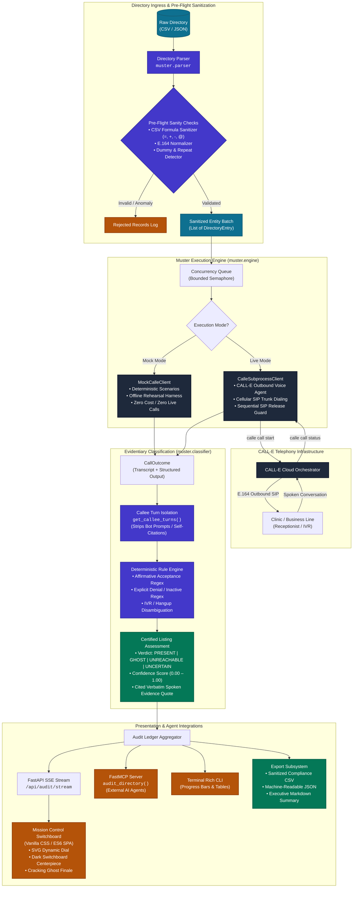
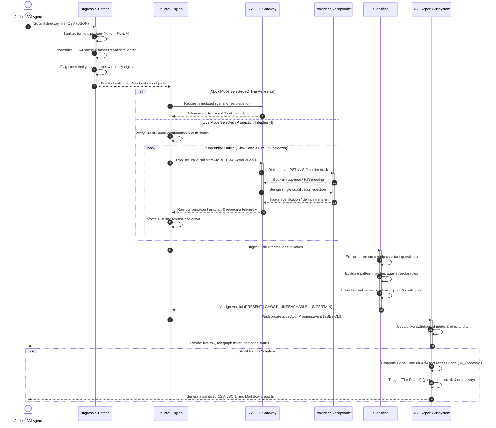
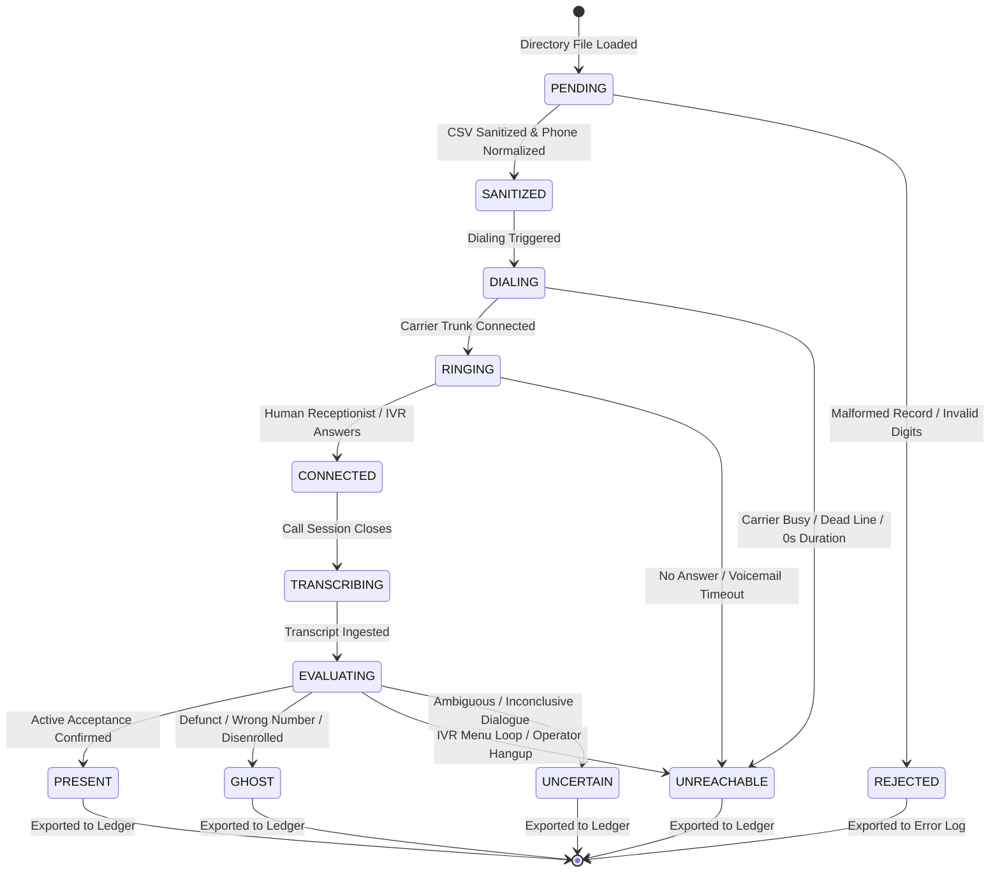

# Muster

<p align="center">
  <a href="https://github.com/omshukla24/Muster/actions"></a>
  <a href="https://www.python.org/downloads/"></a>
  <a href="https://www.calle.ai"></a>
  <a href="https://modelcontextprotocol.io/"></a>
  <a href="LICENSE"></a>
</p>

---

> **Autonomous Directory Ghost-Rate Auditor**  
> Muster programmatically verifies public provider and merchant listings by placing autonomous, single-question voice calls via [CALL-E](https://www.calle.ai). It certifies each entry as **Present**, **Ghost**, **Unreachable**, or **Uncertain** with cited verbatim transcript quotes and computes a mathematical directory Ghost Rate with an auditable evidence ledger.

---

## Table of Contents

- [The Problem: The "Ghost Network" Crisis](#the-problem-the-ghost-network-crisis)
- [System Architecture](#system-architecture)
- [Operational Sequence Workflow](#operational-sequence-workflow)
- [Entity Lifecycle & State Machine](#entity-lifecycle--state-machine)
- [Classification & Evidentiary Decision Matrix](#classification--evidentiary-decision-matrix)
- [Mathematical Formulation & Adequacy Tiers](#mathematical-formulation--adequacy-tiers)
- [Sector Archetypes](#sector-archetypes)
- [Defensive Security & Operational Guardrails](#defensive-security--operational-guardrails)
- [Interactive UI & Switchboard Experience](#interactive-ui--switchboard-experience)
- [Developer & Agent Integration](#developer--agent-integration)
- [CLI Reference](#cli-reference)
- [Installation & Quickstart](#installation--quickstart)
- [Repository Structure](#repository-structure)
- [License](#license)

---

## The Problem: The "Ghost Network" Crisis

Public and commercial directories decay rapidly, leaving behind phantom listings that consume hours of wasted human effort:

- **Healthcare Provider Directories (In-Network Doctors & Specialists)**:  
  In a landmark 2023 investigation by the **U.S. Senate Committee on Finance** (*"Ghosts in the Network"*), secret-shopper auditors discovered that **over 80% of listed mental health providers** across 12 major commercial health plans were unreachable, not accepting new patients, or no longer participating in the network. Similarly, **Centers for Medicare & Medicaid Services (CMS)** audits have consistently found that more than **52% of provider directory listings** contained erroneous information. For patients experiencing acute behavioral health crises or severe medical conditions, dialing a dozen numbers only to hit disconnected lines or wrong clinics causes dangerous delays in care.
- **E-Commerce & B2B Vendor Directories**:  
  Marketplaces advertise tens of thousands of "verified" suppliers and merchants. Over time, businesses dissolve, relocate, or discontinue products without notifying the directory host, resulting in high transaction fallout and supplier fraud.
- **The Core Failure**:  
  Self-reported and static directories rot silently. Traditional manual phone validation costs between **$25 and $50 per listing** and requires months of manual labor. Muster replaces manual surveys with programmatic, real-time telephony audits—interrogating directories at scale and providing verifiable transcript evidence in minutes.

---

## System Architecture

Muster is organized into distinct, loosely coupled subsystems: Directory Ingress, the Asynchronous Telephony Engine, the Evidentiary Classifier, and the Presentation/Export Layer.



---

## Operational Sequence Workflow

The sequence diagram illustrates how Muster processes a directory audit from file ingestion to final report generation:



---

## Entity Lifecycle & State Machine

Each listing passes through a deterministic lifecycle from initial intake to final ledger certification:



---

## Classification & Evidentiary Decision Matrix

Muster enforces deterministic evidentiary standards. Classifications are not guesses—every verdict is tied to spoken proof:

| Verdict | Definition | Confidence Range | Qualifying Conditions & Evidentiary Triggers | Sample Cited Evidence Quote | Recommended Action |
| :--- | :--- | :---: | :--- | :--- | :--- |
| **`PRESENT`** | Active, verified participant | `0.80` – `0.98` | Staff explicitly confirms active network participation and/or open intake for new appointments. | *"Yes, we are in-network with BlueCross and currently accepting new patients."* | Retain in active directory. Mark verified. |
| **`GHOST`** | Phantom listing / defunct entry | `0.85` – `0.98` | Line reaches wrong entity, callee explicitly confirms provider departed or retired, or line is disconnected. | *"Dr. Jenkins retired three years ago. This number is now an accounting firm."* | Immediate removal from directory. Notify regulator/insurer. |
| **`UNREACHABLE`**| Non-responsive terminal failure | `0.70` – `0.90` | Number rings without answer, carrier returns immediate busy/reorder tone, or call terminates inside an automated IVR loop. | *Carrier signal: NO_ANSWER or terminal IVR loop.* | Flag for telecommunications re-audit or secondary number lookup. |
| **`UNCERTAIN`** | Inconclusive interaction | `0.40` – `0.60` | Operator answered with standard greeting but hung up or transferred to hold before verification was provided. | *"Mount Sinai Hospital, how can I direct your call? [Call Ended]"* | Queue for secondary human operator review. |

---

## Mathematical Formulation & Adequacy Tiers

Muster calculates headline directory health metrics derived directly from empirical call outcomes:

### 1. The Directory Ghost Rate ($GR$)
The Ghost Rate represents the percentage of verified listings that are provably defunct, misattributed, or no longer participating:

$$GR = \frac{N_{\text{Ghost}}}{N_{\text{Present}} + N_{\text{Ghost}}} \times 100$$

*(Unreachable and Uncertain listings are excluded from the primary denominator to prevent false-positive inflation, but are tracked in secondary reachability metrics).*

### 2. Patient / Consumer Access Barrier Multiplier ($N_{\text{access}}$)
The expected number of directory calls a consumer or patient must make before reaching a single legitimate, active listing:

$$N_{\text{access}} = \frac{1}{1 - \left(\frac{GR}{100}\right)} = \frac{N_{\text{Present}} + N_{\text{Ghost}}}{N_{\text{Present}}}$$

*Example: In an audited directory with a 58.3% Ghost Rate, $N_{\text{access}} \approx 2.40$ calls per valid listing.*

### 3. Directory Health Classification Tiers

| Tier | Ghost Rate ($GR$) | Statutory Assessment | System Status |
| :--- | :---: | :--- | :--- |
| **Tier 1: PRIME** | $< 10.0\%$ | Compliant with standard network adequacy thresholds | Healthy Directory |
| **Tier 2: COMPROMISED** | $10.0\% - 25.0\%$ | Moderate directory decay; targeted remediation required | Warning / Advisory |
| **Tier 3: HIGH-RISK** | $25.1\% - 50.0\%$ | Significant consumer harm; material violation of directory rules | Degraded Directory |
| **Tier 4: DEFECTIVE** | $> 50.0\%$ | Chronic ghost network; referral for statutory regulatory enforcement | Non-Compliant / Defective |

---

## Sector Archetypes

Muster supports pluggable sector archetypes, each defining custom extraction goals and verification schemas:

| Sector Archetype | Target Directory Listings | Autonomous Qualification Question | Extracted Schema Attributes |
| :--- | :--- | :--- | :--- |
| **`US_INSURER`** | Primary care physicians, mental health therapists, outpatient clinics, specialists | *"Hello, I am calling to verify directory network status. Are you currently in-network and accepting new patients?"* | `in_network` (bool), `accepting_new_patients` (bool), `provider_name` (str), `specialty` (str) |
| **`MARKETPLACE_SELLER`**| Verified marketplace vendors, third-party merchants, supply-chain distributors | *"Hello, I am calling to verify your storefront listing. Are you currently active and fulfilling orders under your business name?"* | `is_operational` (bool), `fulfilling_orders` (bool), `business_name_match` (bool) |
| **`CUSTOM`** | Extensible domain directories | User-defined via `--goal` CLI argument or MCP parameter | Dynamically structured key-value extraction |

---

## Defensive Security & Operational Guardrails

Muster incorporates multi-layer security protections for public directory auditing:

1. **Spreadsheet Formula Injection Sanitization (CSV)**:  
   All imported directory fields and exported CSV reports pass through `muster.parser.sanitize_cell()`. Any field starting with formula execution characters (`=`, `+`, `-`, `@`, `\t`, `\r`) is prepended with a single quote (`'`), neutralizing Remote Code Execution (RCE) vulnerabilities in Microsoft Excel and Google Sheets.
2. **Pre-Call Phone Anomaly Detection**:  
   Before any telephony connection is initiated, listings are evaluated against telephony sanity rules:
   - Verification of standard E.164 format and valid national number lengths.
   - Rejection of repetitive dummy digits (`+15550000000`, `+11111111111`).
   - Detection of cross-entity duplicate phone numbers (flagging broker identity reuse).
3. **Strict Privacy & Phone Masking Contract**:  
   - All phone numbers rendered in web UI telemetry, progress tickers, and generated reports are strictly masked (`+1 (212) •••-••44` or `+91 98••••••44`).
   - Zero unmasked personal phone numbers or Protected Health Information (PHI) are ever logged, stored, or output in documentation.
4. **Dual-Gated Credit Guard System**:  
   - Live calls consume CALL-E voice agent credits (~34 credits/minute).
   - Mock mode is active by default. Live calls require an explicit interactive terminal confirmation (`--confirm-live`) or an interactive modal confirmation in the web dashboard.
   - Sequential dialing (`concurrency: 1`) with a 4.0s carrier SIP trunk cooldown prevents line contention and carrier rejection.
5. **Zero-Live-Calls Guarantee in Automated Tests**:  
   The test suite patches `subprocess.run` and enforces via unit tests (`test_zero_live_calls_guarantee`) that no real telephony subprocess can execute during test runs.

---

## Interactive UI & Switchboard Experience

Muster features a purpose-built Mission Control interface (`http://127.0.0.1:8000`) designed around the visual metaphor of an archival switchboard:

- **Archival Paper & Typography**: Warm paper tones paired with editorial Newsreader serif typography for an official audit ledger feel.
- **Dark Switchboard Centerpiece**: A circular switchboard display (`#171a21`) featuring a central operator hub, radial spoke lines, and interactive peripheral nodes representing each directory listing.
- **Bidirectional Ledger Interaction**: Hovering or clicking a ledger row pulses the corresponding switchboard node; clicking a switchboard node scrolls directly to the verified listing card.
- **Dynamic Circular Dial**: Real-time animated SVG circular arc that fills with color (emerald for healthy directories, oxblood for ghost networks) and counts up to the calculated Ghost Rate.
- **"The Reveal" Finale**: Upon audit completion, confirmed ghost listings crack and drop away from the switchboard with a downward translation animation, leaving only verified active providers standing.

---

## Developer & Agent Integration

### 1. FastMCP Server Integration
Muster exposes its auditing engine as a Model Context Protocol (MCP) server, allowing AI agents (such as Claude Desktop, Cursor, or custom autonomous agents) to invoke directory audits natively:

```python
# Launching the FastMCP server
python -m muster.mcp_server
```

Configure your agent environment (`mcp_config.json`):

```json
{
  "mcpServers": {
    "muster": {
      "command": "python",
      "args": ["-m", "muster.mcp_server"],
      "env": {
        "PYTHONPATH": "."
      }
    }
  }
}
```

Invoke via Python programmatically:

```python
import asyncio
from muster.mcp_server import audit_directory

async def main():
    report = await audit_directory(
        file_path="sample_data/us_insurer_network.json",
        sector="US_INSURER",
        mode="mock",  # Set to "live" for production telephony
    )
    print(f"Ghost Rate: {report['ghost_rate_pct']}%")
    print(f"Verified Listings: {report['counts']['present']} Present, {report['counts']['ghost']} Ghost")

asyncio.run(main())
```

### 2. Reusable Agent Skill
Muster is packaged as an agent skill under `skills/muster/` conforming to the [awesome-phone-call-agents](https://github.com/CALLE-AI/awesome-phone-call-agents) specification:

```bash
# Execute via the standalone skill runner script
python skills/muster/scripts/run_audit.py sample_data/us_insurer_network.json --mode mock
```

---

## CLI Reference

Muster provides a terminal interface built with Rich for interactive progress reporting:

```bash
# General Syntax
python -m muster.cli <COMMAND> [OPTIONS]
```

### Commands & Options

| Command | Option | Type | Default | Description |
| :--- | :--- | :---: | :---: | :--- |
| `audit` | `<file_path>` | Positional | *Required* | Path to CSV or JSON directory file to audit |
| `audit` | `--mode` | Choice | `mock` | Execution mode: `mock` (free, offline) or `live` (places CALL-E calls) |
| `audit` | `--sector` | Choice | `US_INSURER` | Audit sector archetype: `US_INSURER` or `MARKETPLACE_SELLER` |
| `audit` | `--goal` | String | `None` | Custom autonomous qualification prompt for the telephony agent |
| `audit` | `--concurrency`| Integer | `1` | Simultaneous call channels (enforced to 1 in Live mode) |
| `audit` | `--timeout` | Integer | `180` | Per-call timeout ceiling in seconds |
| `audit` | `--out` | Path | `reports/` | Output directory for CSV, JSON, and Markdown compliance reports |
| `audit` | `--confirm-live`| Flag | `False` | Bypasses interactive confirmation prompt in Live mode |
| `ui` | `--port` | Integer | `8000` | Port for the local FastAPI web switchboard |
| `ui` | `--host` | String | `127.0.0.1` | Host address binding for the web server |

---

## Installation & Quickstart

### Prerequisites
- Python 3.10 or higher
- Git
- *(Optional for Live mode)* [CALL-E CLI](https://www.calle.ai) v0.5.1+ authenticated via `calle auth login`

### 1. Clone & Install
```bash
git clone https://github.com/omshukla24/Muster.git
cd Muster

# Install in editable mode with development dependencies
pip install -e .
```

### 2. Run the Web Dashboard
```bash
python -m muster.cli ui --port 8000
```
Open **`http://127.0.0.1:8000`** in your browser. The dashboard loads the bundled US Insurer network preset ready for instant mock or live execution.

### 3. Run a Mock Audit (CLI)
```bash
# Free, instantaneous, zero live calls
python -m muster.cli audit sample_data/us_insurer_network.json --mode mock
```

### 4. Run a Live Telephony Audit (CLI)
```bash
# Requires authenticated CALL-E CLI
python -m muster.cli audit sample_data/live_demo_audit_3.json --mode live --concurrency 1
```

### 5. Run the Automated Test Suite
```bash
pytest -v
```
*Executes all 33 automated tests in <0.2 seconds with the zero-live-calls guarantee enforced.*

---

## Repository Structure

```
Muster/
├── .gitignore                    # Strict exclusions (handoff/, .env, reports/, caches)
├── pyproject.toml                # Build configuration and project dependencies
├── README.md                     # System documentation, architecture, and workflow
├── muster/                       # Core Python package
│   ├── __init__.py               # Package exports and version metadata
│   ├── models.py                 # Pydantic data schemas (Verdict, DirectoryEntry, AuditSummary)
│   ├── parser.py                 # CSV/JSON parser with formula sanitization & phone checks
│   ├── classifier.py             # Rule-based evidentiary classification engine
│   ├── calle_client.py           # Subprocess CALL-E client + deterministic mock harness
│   ├── engine.py                 # Asynchronous concurrency runner with SSE event streaming
│   ├── report.py                 # Compliance report generator (CSV, JSON, Markdown)
│   ├── mcp_server.py             # FastMCP server exposing directory auditing tools
│   ├── cli.py                    # Terminal CLI with Rich tables and progress bars
│   └── app/                      # Web Switchboard application
│       ├── server.py             # FastAPI backend with SSE event stream endpoint
│       └── static/               # Zero-build static frontend
│           ├── index.html        # Single-page application markup
│           ├── css/
│           │   ├── tokens.css    # Design tokens (typography, colors, shadows)
│           │   └── style.css     # Switchboard layout, node animations, and modal styles
│           └── js/
│               └── app.js        # SSE consumer, switchboard renderer, and audio modals
├── sample_data/                  # Bundled audit datasets (fictional +1 555 numbers)
│   ├── us_insurer_network.json   # 12 healthcare listings (Family medicine, therapy, clinics)
│   ├── us_insurer_network.csv    # CSV variant of the healthcare network
│   ├── marketplace_sellers.json  # 6 marketplace merchant storefronts
│   ├── therapists_network.json   # 8 behavioral health practitioner listings
│   ├── live_demo_audit.json      # Dedicated live validation dataset
│   └── live_demo_audit_3.json    # 3-facility verified live telephony dataset
├── skills/                       # Reusable Agent Skills (awesome-phone-call-agents)
│   └── muster/
│       ├── SKILL.md              # Reusable skill specification and usage guide
│       ├── references/
│       │   └── safety.md         # 7-point telephony safety contract
│       └── scripts/
│           └── run_audit.py      # Portable standalone skill runner
└── tests/                        # Automated unit tests (33 tests, 100% offline)
    ├── conftest.py               # Shared fixtures and mock factory
    ├── test_parser.py            # CSV/JSON parsing, formula sanitization, and phone validation
    ├── test_classifier.py        # Evidentiary rules, verbatim quote extraction, and hangup tests
    ├── test_calle_client.py      # Subprocess client attribution and mock scenarios
    ├── test_engine.py            # Concurrency control, event ordering, and reports
    ├── test_ghost_rate.py        # Mathematical formula tests and edge cases
    └── test_milestones.py        # Milestone verification & zero-live-call guarantee
```

---

## License

This project is licensed under the MIT License — see the [LICENSE](LICENSE) file for details.
